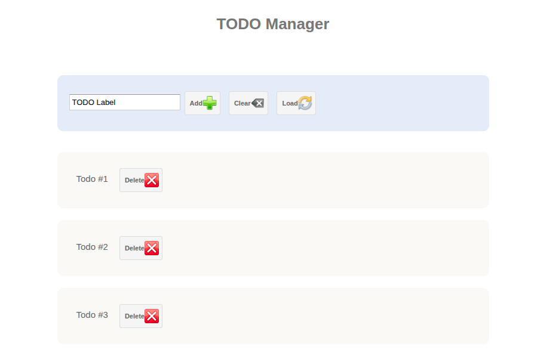

# SpringBoot + GWT

Источник [https://github.com/ekito/spring-boot-gwt](https://github.com/ekito/spring-boot-gwt)

### Запуск

Java 1.8

````shell
export JAVA_HOME=/usr/lib/jvm/java-8-openjdk-amd64/
mvn clean gwt:run
````

Открыть [http://127.0.0.1:8888/GwtWebApp.html](http://127.0.0.1:8888/GwtWebApp.html)



Java 11 не работает. Ошибка:

````
export JAVA_HOME=/usr/lib/jvm/java-11-openjdk-amd64
Ошибка [ERROR] Source level must be one of [auto, 1.8].
````

Интерфейс некузявый, но __есть__ связь с Spring boot. 
Приложение инициализируется не как обычно через @SpringBootApplication, а через ( [см. fr.ekito.gwt.server.ServerApplication](https://github.com/cherepakhin/spring-boot-gwt/blob/main/src/main/java/fr/ekito/gwt/server/ServerApplication.java))

````java
@Configuration
@EnableAutoConfiguration
@ComponentScan("fr.ekito.gwt.server")
public class ServerApplication {

	final static Logger logger = LoggerFactory.getLogger(ServerApplication.class);

	@Autowired
	Environment env;

	/**
	 * entry point
	 * 
	 * @param args
	 */
	public static void main(String[] args) {
		SpringApplication.run(ServerApplication.class, args);
	}
	
}
````

Связь frontend c backend:

[fr.ekito.gwt.server.ServerApplication](https://github.com/cherepakhin/spring-boot-gwt/blob/main/src/main/java/fr/ekito/gwt/client.controller/WebAppController.java):

````java
protected void loadTodoList() {
String pageBaseUrl = GWT.getHostPageBaseURL();
// String baseUrl = GWT.getModuleBaseURL();
RequestBuilder rb = new RequestBuilder(RequestBuilder.GET, pageBaseUrl + "/rest/todos/");
rb.setCallback(new RequestCallback() {

			public void onError(Request request, Throwable e) {
				// some error handling code here
				Window.alert("error = " + e.getMessage());
			}

			public void onResponseReceived(Request request, Response response) {
				if (200 == response.getStatusCode()) {
					String text = response.getText();
					// some code to further handle the response here
					System.out.println("text = " + text);
					Window.alert("response = " + text);
					List<Todo> todoList = JsonHelper.parseDataList(text);
					reloadList(todoList);
				}
			}
		});
		try {
			rb.send();
		} catch (RequestException e) {
			e.printStackTrace();
			Window.alert("error = " + e.getMessage());
		}
	}
````

Оригинальный Readme.md:

spring-boot-gwt
===============

A quickstart spring boot gwt application (Spring Boot 1.4.1, GWT 2.8)

## GWT Developer Console

Use the GWT console with : 
- mvn gwt:run
- mvn gwt:debug
or simply use mvn install as useal


## What's in the sources

Quick dive in the code :

- fr.ekito.gwt.server for server side code
- fr.ekito.gwt.client for GWT client side code
- fr.ekito.gwt.client.controller contains Client Http Rest controller

The application is build uppon Google Gin 

## More details

More details about the project on Ekito's blog :  http://www.ekito.fr/people/?p=4816


